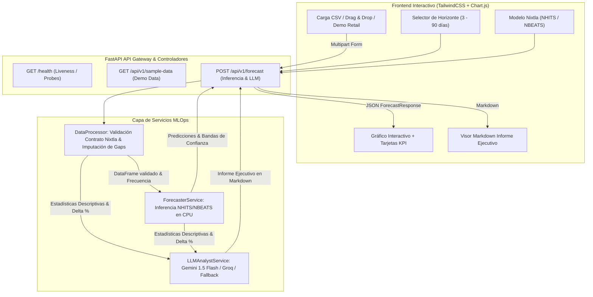

# 📈 Retail Forecast AI: Demand Forecasting & Inventory Strategist

> **Plataforma productiva de analítica y pronóstico de series temporales en Retail con redes neuronales de Nixtla (`neuralforecast`), interpretación cualitativa mediante LLMs (Google Gemini / Groq), validación estricta de esquemas y despliegue automatizado en Render con Docker.**

[](https://github.com/your-org/retail-forecast-ai/actions)
[](https://fastapi.tiangolo.com)
[](https://nixtla.github.io/neuralforecast/)
[](https://pytorch.org/)
[](https://www.docker.com/)
[](https://render.com)

---

## 🏛️ 1. Arquitectura Técnica del Sistema

El sistema fue diseñado por un Staff MLOps & Software Engineer bajo principios de alta resiliencia, bajo consumo de memoria (compatible con los límites de 512MB-1GB RAM de Render) y separación estricta de responsabilidades:



---

## 🛠️ 2. Stack Tecnológico & Decisiones de Diseño

| Componente | Tecnología | Razón de Elección / Decisión MLOps |
| :--- | :--- | :--- |
| **Runtime** | Python 3.11 Slim | Estabilidad, compatibilidad con wheels de PyTorch y mínimo footprint. |
| **API Framework** | FastAPI + Pydantic v2 | Alto rendimiento asíncrono, OpenAPI automática (`/docs`) y tipado estricto. |
| **Forecasting** | Nixtla `neuralforecast` | Arquitecturas **NHITS** y **NBEATS** optimizadas para CPU (`max_steps=60`, `batch_size=32`), evitando OOM en instancias limitadas. |
| **PyTorch** | PyTorch CPU-Only | Instalado vía `--index-url https://download.pytorch.org/whl/cpu`, reduciendo la imagen Docker de ~4GB a menos de 450MB. |
| **LLM Engine** | Google Gemini / Groq | Capacidad de análisis de demanda en lenguaje natural con soporte de tiers gratuitos y fallback heurístico integrado si no hay API key. |
| **Frontend** | Vanilla JS + Tailwind + Chart.js | Cero dependencias pesadas de Node en tiempo de build, renderizado instantáneo y visualización interactiva de series. |
| **CI/CD** | GitHub Actions (`ci.yml`) | Automatización de linters (`ruff`) y suite de pruebas unitarias/integración (`pytest`). |
| **Infraestructura** | Docker + Render (`render.yaml`) | Despliegue reproducible como código con usuario no-root por seguridad. |

---

## 📋 3. Contrato de Datos (Estándar Nixtla)

El endpoint `/api/v1/forecast` valida estrictamente la estructura del CSV:

| Columna | Tipo | Descripción | Ejemplo |
| :--- | :--- | :--- | :--- |
| `unique_id` | `string` | Identificador de la tienda, producto o SKU. | `STORE_01_BEVERAGES` |
| `ds` | `date` o `datetime` | Marca temporal en formato ISO (YYYY-MM-DD). | `2025-01-15` |
| `y` | `float` | Métrica numérica observada (ventas, demanda). | `148.7` |

### Reglas de Calidad y Validación:
- **Detección y Relleno de Gaps:** Si existen fechas intermedias sin registro (ej. días de tienda cerrada), el sistema genera el rango continuo e imputa `y = 0.0` (estándar retail).
- **Mínimo Histórico:** Requiere al menos 14 observaciones históricas para inicializar las ventanas de redes neuronales.
- **Cero Ventas Negativas:** Restricción económica de retail aplicada a las predicciones (`y_hat >= 0.0`).

---

## 🚀 4. Puesta en Marcha Local

### Prerrequisitos
- Python 3.10 o 3.11 instalado.
- Git.

### 1. Clonar el repositorio
```bash
git clone https://github.com/your-org/retail-forecast-ai.git
cd retail-forecast-ai
```

### 2. Crear y activar entorno virtual
```bash
# En Windows (PowerShell)
python -m venv venv
.\venv\Scripts\Activate.ps1

# En Linux / macOS
python3 -m venv venv
source venv/bin/activate
```

### 3. Instalar PyTorch CPU y dependencias
```bash
# 1. Instalar primero PyTorch CPU para evitar descargar CUDA
pip install --upgrade pip
pip install torch --index-url https://download.pytorch.org/whl/cpu

# 2. Instalar el resto de dependencias
pip install -r requirements.txt
```

### 4. Configurar Variables de Entorno (Opcional)
Copia el archivo de ejemplo o crea un `.env`:
```bash
# .env
PORT=8000
DEBUG=true

# Proveedor LLM: "gemini", "groq", "auto" o "heuristic"
LLM_PROVIDER=auto

# API Keys gratuitas (si no se configuran, la app opera con el motor heurístico experto)
GEMINI_API_KEY=tu_api_key_de_google_ai_studio
GROQ_API_KEY=tu_api_key_de_groq
```

### 5. Iniciar la aplicación
```bash
uvicorn app.main:app --host 0.0.0.0 --port 8000 --reload
```
Abre tu navegador en:
- **Dashboard Web:** [http://localhost:8000](http://localhost:8000)
- **Documentación Swagger:** [http://localhost:8000/docs](http://localhost:8000/docs)
- **Healthcheck:** [http://localhost:8000/health](http://localhost:8000/health)

---

## 🧪 5. Pruebas Automatizadas y Calidad de Código

Ejecuta el linter y la suite de pruebas unitarias e integración:

```bash
# 1. Verificar calidad y formato con Ruff
ruff check .

# 2. Ejecutar pruebas con Pytest
pytest -v tests/
```

Las pruebas cubren:
- Ingesta de CSV válidos e inválidos.
- Manejo de fechas no ISO y errores semánticos (código 422).
- Relleno de discontinuidades temporales (gaps).
- Consistencia del cálculo de estadísticas operativas (media, CV, tendencia).
- Pruebas de integración para `/health`, `/api/v1/sample-data`, `/api/v1/models` y `/api/v1/forecast`.

---

## 🐳 6. Despliegue con Docker

Construye y corre el contenedor en tu máquina local:

```bash
# Construir la imagen
docker build -t retail-forecast-ai:latest .

# Ejecutar el contenedor
docker run -d -p 8000:8000 \
  -e GEMINI_API_KEY="tu_key_aqui" \
  --name retail_ai_app \
  retail-forecast-ai:latest

# Inspeccionar logs
docker logs -f retail_ai_app
```

---

## ☁️ 7. Despliegue en Render (Infrastructure as Code)

El proyecto incluye el manifiesto `render.yaml` listo para despliegue en un clic:

### Opción A: Despliegue mediante Blueprints (Recomendada)
1. Haz un push de este repositorio a tu cuenta de **GitHub**.
2. Ingresa a tu panel en [Render.com](https://dashboard.render.com).
3. Haz clic en **New +** y selecciona **Blueprint**.
4. Conecta tu repositorio de GitHub. Render detectará automáticamente `render.yaml`.
5. Si deseas activar el análisis cualitativo con LLM en tiempo real, ingresa tu `GEMINI_API_KEY` o `GROQ_API_KEY` en los campos solicitados.
6. Haz clic en **Apply**. Render construirá el Dockerfile y aprovisionará el servicio web.

### Opción B: Despliegue Manual como Web Service
1. En Render, crea un nuevo **Web Service**.
2. Selecciona **Docker** como entorno de ejecución (Runtime).
3. Configura las siguientes variables de entorno en el panel:
   - `PORT`: `8000`
   - `GEMINI_API_KEY`: *(opcional, tu clave de Gemini)*
   - `GROQ_API_KEY`: *(opcional, tu clave de Groq)*
4. Health Check Path: `/health`.

---

## 📂 8. Estructura del Repositorio

```text
├── .github/
│   └── workflows/
│       └── ci.yml                   # Pipeline de integración continua (Ruff + Pytest)
├── app/
│   ├── __init__.py                  # Metadata de versión
│   ├── main.py                      # Punto de entrada FastAPI, rutas y manejo de errores
│   ├── config.py                    # Configuración centralizada vía Pydantic Settings
│   ├── schemas/
│   │   ├── __init__.py
│   │   └── forecast.py              # Esquemas Pydantic v2 (DataPoint, ForecastResponse, etc.)
│   ├── services/
│   │   ├── __init__.py
│   │   ├── data_processor.py        # Ingesta, validación Nixtla, gap filling y stats
│   │   ├── forecaster.py            # Pipeline Nixtla NeuralForecast (NHITS/NBEATS en CPU)
│   │   └── llm_analyst.py           # Generación de informe ejecutivo (Gemini / Groq / Fallback)
│   └── static/
│       ├── index.html               # Dashboard web moderno con Tailwind y Chart.js
│       └── app.js                   # Lógica reactiva de cliente, fetch API y gráficos
├── data/
│   └── sample_retail_sales.csv      # Dataset retail para pruebas inmediatas
├── tests/
│   ├── __init__.py
│   ├── test_data_processor.py       # Pruebas unitarias de datos y estadísticas
│   └── test_api.py                  # Pruebas de integración HTTP
├── Dockerfile                       # Imagen de producción ligera con usuario no-root
├── requirements.txt                 # Dependencias fijadas y compatibles
├── .dockerignore                    # Exclusiones del contexto Docker
├── .gitignore                       # Exclusiones de control de versiones
├── render.yaml                      # Manifiesto Infrastructure as Code para Render
└── README.md                        # Documentación técnica completa
```

---

## 🔒 9. Seguridad & Principios MLOps Implementados

- **Contenedor Seguro:** Ejecución exclusiva bajo usuario no privilegiado (`appuser`, UID 1000).
- **Control de Ingesta:** Límite máximo de tamaño de carga (20MB) y validación de tipos MIME y encabezados.
- **Códigos HTTP Semánticos:** Respuestas explícitas `200 OK`, `422 Unprocessable Entity` para contratos violados, `413 Payload Too Large`, y `500 Internal Server Error` estructurado.
- **Resiliencia Operativa:** Si el servicio externo de LLM experimenta indisponibilidad o si no se configuraron credenciales, el motor ejecuta un análisis heurístico experto basado en reglas cuantitativas de inventario (CV, ROP, stock de seguridad) sin interrumpir el servicio.
